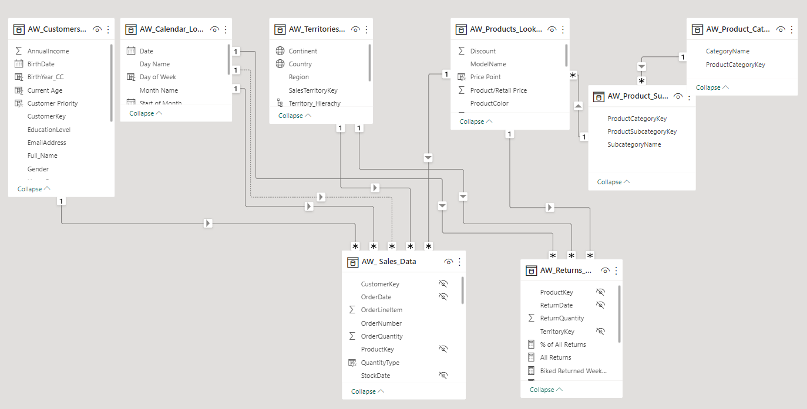

# Adventure-Works-Cycle
A global manufacturing company in Europe, North America and Australia.

## Introduction

This is a Microsoft Power BI Project on sales analysis of an imaginary Company called **Adventure Works Cycles**. The project aim to design and deliver an end-to-end business intelligence solution. 

## Brief

To track KPIs (Sales, Revenue, Profit, Returns), compare regional performance, analyze product-level trends and identify high-value customers.

## Datasets 

The datasets contain a folder of raw csv files about transactions, returns, products, customers and territories.

## Objectives

- Connect and transform the raw data
- Build a relational data model
- Create new calculated columns and DAX measures
- Design an interactive report to analyze and visualize the datasets

## Modelling

There are 6-dimesion tables and 2 fact tables. The dimension tables are all joined to the fact table.

Model
:----------------------:

